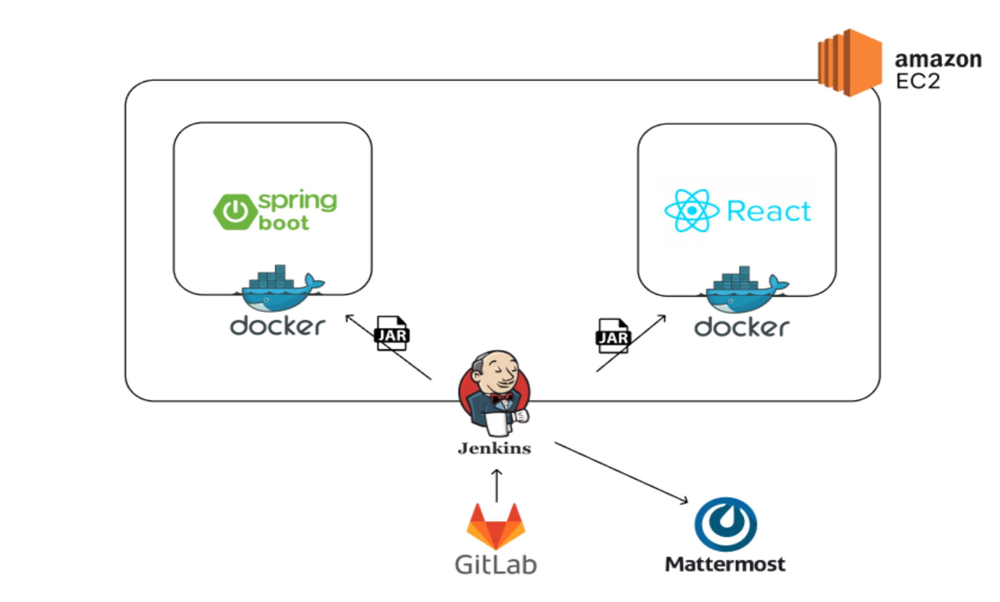

<h4> 누구나 부담없이 사용하는 익명 글 공유 서비스 </h4>
<h3> 판도라의 숲 </h3>

## ✅ 프로젝트 진행 기간

### 2024.01.08 ~ 2024.04.16(6주)

## **✅ 프로젝트 소개**

**🚩 서비스 한줄 소개**

`익명 글 공유 서비스
"개시글을 작성할 때 마다 랜덤닉네임 부여, 팔로워/팔로잉을 신경쓰지 않아 부담없는 글 공유 SNS 서비스 '판도라의 숲'"`

**🚩 기획 배경**

- 자신의 사소하고 비밀스러운 이야기를 공유하고 공감받고 싶어하는 사용자가 많지만  기존의 SNS는 고정된 닉네임을 사용하거나 주변 사람들과 ID를 공유하며 사용하기 때문에 완벽한 익명성을 보장하기 힘들다고 생각했습니다.
- 또한 기존의 SNS는 자신의 팔로우 하는 사람이 많을수록 소통이 더 잘 이루어지고, 해당 플랫폼에 영향을 많이 끼치고 있습니다.
- 따라서 저희는 자신의 이야기를 공유하고 공감받고 싶어하는 사용자가 부담없이 사용할 수 있도록 글 마다 랜덤닉네임을 부여하고 팔로우/팔로워가 없는 글 공유 플렛폼을 만들고자 합니다.

**🚩 기술 스택**
|  | skills |
| --- | --- |
| Backend |    |
| Frontend |    |
| Infra |     |
| 협업 툴 |     |
| 디자인 |  |

## **✅ 프로젝트 설명 및 특장점**

- 공유하고 싶은 글을 원하는 사진과 함께 공유할 수 있고, 공유된 글과 사진들을 숏츠형식으로 편하게 확인할 수 있습니다.
- 원하는 게시글에 좋아요와 댓글, 대댓글을 달 수 있습니다.
- 마음에 드는 게시글을 보관 버튼을 통해 보관하고 마이페이지에서 보관한 글을 다시 확인할 수 있습니다.
- 글을 작성하던 도중 임시저장을 할 수 있으며 다음에 다시 작성하고 싶을때 임시저장글을 불러와 다시 작성할 수 있습니다.
- 게시글을 작성할 때 마다 새로운 닉네임이 랜덤으로 부여되며, 댓글 또한 게시글 별로 랜덤 닉네임이 부여됩니다.
- 마이페이지에서 보관한 글과 내가 작성한 글을 확인할 수 있습니다.
- 내 글에 좋아요, 댓글, 대댓글이 달렸을 때 알림을 받을 수 있습니다.

**🚩 프로젝트 확장성**

판도라의 숲을 더욱 개선된 서비스로 발전시키기 위해 두 가지 확장성 또한 고려할 수 있습니다.

- 쇼츠 알고리즘 개선
    - 사용자가 증가하게 되면 사용자가 주로 관심있어 하는 글의 데이터를 수집하고 분석하여 알고리즘을 개선한다면 맞춤 컨텐츠 제공이 가능합니다.
- 성별 또는 연령대 별 게시판 생성
    - 성별 또는 연령대 정보를 수집해 해당 성별 또는 연령대의 사용자들이 작성한 게시글을 볼 수 있도록 함으로써 사용자가 더 관심 가질만한 게시글을 확인할 수 있습니다.

## ✅ 산출물

 ERD 

 시스템 아키텍처 

 기능 명세서

 와이어 프레임 

[와이어 프레임 링크](https://www.figma.com/design/4yc4GtoT9B4qryWfcK7Scu/%ED%8C%90%EB%8F%84%EB%9D%BC%EC%9D%98-%EC%88%B2?node-id=0-1)

 API 명세서

[API 명세서 링크](https://smiling-park-873.notion.site/API-e997fb927fcf4eb5926a726b33666c58?pvs=4)

## ✅ 기능 소개

### 1. 회원가입 및 로그인 🧑👩

| GIF | 설명 |
| :---: | :--- |
|  |**회원가입**      - 이메일이 이미 사용중인 이메일인지 중복 확인을 진행한다. - 영문 소문자, 숫자 각 1개 이상 조합하여 5-20자만을 비밀번호로 사용할 수 있도록 비밀번호 유효성 검사를 실행한다. - 영문자,한글, 숫자 및 언더바를 포함할 수 있으며 3-10자 닉네임 유효성 검사를 시행한다. - 다른 사용자와 닉네임이 중복되지 않도록 닉네임이 이미 사용중인 닉네임인지 중복확인을 진행한다.      **로그인**   - 이메일과 비밀번호로 로그인|

### 2. 회원가입 직후 추가정보입력 및 가이드 📄

| GIF | 설명 |
| :---: | :--- |
|  |**칵테일 취향선택1**      - 신규회원일 경우 기본값으로 설정될 본인의 칵테일 취향정보를 입력할 수 있다. - 자신의 취향에 맞는 도수, 단맛, 신맛, 쓴맛, 탄산 정도를 6단계로 나누어 선택할 수 있다.|
|  |**칵테일 취향선택2**      - 자신의 취향에 맞는 칵테일 선택할 수 있다. - 해당 취향 선택은 추후 칵테일 추천 데이터로 활용된다.|
|  |**Catale 가이드 페이지**     - 신규회원일 경우 취향선택이 끝나면 가이드 페이지를 통해 Catele 사용방법 확인할 수 있다.|

### 3. 오늘의 칵테일 추천

| GIF | 설명 |
| :---: | :--- |
|  |**오늘의 기분 선택**      - 오늘의 칵테일 추천받기 버튼을 누르면 바텐더와의 대화를 통해 칵테일 추천을 시작한다. - 매우나쁨, 나쁨, 보통, 좋음, 매우좋음 5가지 중 오늘의 나의 기분 선택할 수 있다. - 선택한 기분은 월별로 통계를 내어 마이페이지에서 원형 그래프로 제공된다.|
|  |**오늘의 감정 선택**      - 기분선택 후 오늘의 감정을 세가지 선택할 수 있다. - 아니야 다시 선택할래 버튼을 누르면 감성 세가지 다시 선택 가능하다. - 선택한 감정은 이미 지정된 감정 색깔을 통해 비슷한 색을 가진 칵테일을 추천하도록 한다.|
|  |**감정에 영향을 준 이유 선택 / 오늘의 코멘트**     - 감정에 영향을 준 이유를 선택지에서 선택할 수 있으며 원하는 선택지가 없으면 직접 쓸 수 있다. - 오늘의 감정에 대한 한줄 코멘트 작성할 수 있으며 작성을 원하지 않을 경우 건너뛰기를 할 수 있다. - 감정에 영향을 준 이유와 오늘의 코멘트는 일기내용에 포함된다.|
|  |**취향도수 선택 / 블랜딩**     - 회원 정보에 등록된 취향 도수를 기준점으로 추천받고 싶은 칵테일의 도수를 선택할 수 있다.  - 추천되는 칵테일에 영향을 미친다.|
|  |**오늘의 칵테일 추천 결과**     - 등록한 감정과 칵테일의 색 조합, 선택 도수 정보를 기반으로 오늘의 칵테일을 선정하여 오늘의 칵테일로 보여준다. - 선정된 오늘의 칵테일과의 속성을 비교하여 유사도가 높은 칵테일들을 선별하고 비슷한 칵테일 목록으로 제공한다. - 재추천이 가능하며 마지막으로 추천받은 칵테일과 쟉성한 일기를 기준으로 캘린더에 기록된다.|

### 4. 칵테일 검색

| GIF | 설명 |
| :---: | :--- |
|  |**키워드 검색**      - 기본 화면은 좋아요 많은 순의 칵테일 리스트 제공한다. - 찾고자 하는 칵테일 이름 검색을 통한 칵테일 검색할 수 있다.|
|  |**옵션 검색**      - 도수/단맛/신맛/쓴맛/탄산감 설정을 통한 범위 내 칵테일을 필터링 해준다.|

### 5. 칵테일 상세 및 리뷰작성하기

| GIF | 설명 |
| :---: | :--- |
|  |**칵테일 상세**      - 칵테일의 이름, 사진, 아이콘과 오각형 그래프를 통해 칵테일의 도수, 맛, 탄산감정보과 칵테일 설명, 칵테일 재료정보 제공한다. - 해당 칵테일을 판매하고 있는 유성구의 칵테일바 리스트를 소개한다.|
|  |**칵테일 리뷰**      - 사용자는 개인이 느낀 칵테일의 맛(쓴맛, 신맛, 탄산, 단맛)을 기록하고 별점과 한줄평가를 남길 수 있다. - 초기의 맛 세팅은 칵테일의 기본 맛 정보를 기준으로 세팅되어 있다. - 별점은 1개부터 5개 까지 남길 수 있다. - 한줄 평가와 별점을 적지 않을 경우 리뷰를 남길 수 없다. 자신이 쓴 리뷰만 삭제 가능하다.|

### 6. 주변 칵테일바 조회

| GIF | 설명 |
| :---: | :--- |
|  |**칵테일바 목록**      - 유성구 기준 칵테일바 관련 정보와 위치와 가게의 목록조회를 확인할 수 있다. - 지도에서 칵테일바에 해당하는 마커를 선택하면 해당 칵테일바로 바로 갈수 있게 스크롤이 내려간다.     **칵테일바 상세**      - 특정 칵테일바를 선택하면 칵테일바의 상세정보를 확인 할 수 있다. - 칵테일바의 위치, 이름, 주소, 영업시간 정보와 칵테일바에서 판매하는 칵테일메뉴와 가격, 시그니처 칵테일 정보를 제공한다.|

### 7. 캘린더

| GIF | 설명 |
| :---: | :--- |
|  |**월별기록**     - 사용자가 추천받은 칵테일을 월별로 확인할 수 있다. - 각각의 날짜에 있는 칵테일은 사용자가 추천받은 칵테일이고, 날짜의 테두리는 그날의 감정색을 나타낸다. - <와 > 를 눌러 월이동을 할 수 있다.      **일별기록**      - 월별기록에서 기록이 존재하는 특정날짜를 클릭하면 해당날짜에 추천받은 칵테일을 확인할 수 있다. - 상단에서 칵테일의 설명과 칵테일의 맛정보를 확인하고, 하단에서 그날의 감정이 일기형식으로 적혀진 것을 확인 할 수 있다.|

### 8. 마이페이지

| GIF | 설명 |
| :---: | :--- |
|  |**설정페이지**      - 프로필 변경을 원할 때 원하는 사진으로 프로필 사진을 바꿀 수 있다. - 닉네임을 원하는 이름으로 변경할 수 있다. - 비밀번호 변경을 통해 보안을 강화할 수 있다.|
|  |**나의 취향**      - 첫 회원가입 시 설정한 취향정보를 확인할 수 있다. - 취향을 수정하고 싶은 경우 취향 변경 탭을 통해 나의 취향을 변경할 수 있다. - 취향 칵테일 보러가기에서 나의 취향과 비슷한 취향을 가진 사용자들이 좋아하는 칵테일을 추천한다.|
|  |**내가 마신 칵테일**      - 리뷰를 남긴 칵테일의 리스트를 제공한다. 리스트는 별점 높은 순, 낮은 순, 최신 날짜 순, 오래된 날짜 순으로 정렬할 수 있다. - 칵테일마다 칵테일 아이콘, 이름, 설명정보와 칵테일 별 내가 적은 리뷰 리스트를 확인할 수 있다.|
|  |**좋아요한 칵테일**      - 좋아요를 누른 칵테일의 아이콘과 칵테일 이름 리스트를 제공한다. - 칵테일 아이콘을 누르면 칵테일 상세정보 페이지를 확인할 수 있다.|
|  |**기분 통계 / 로그아웃**      - 오늘의 칵테일을 추천 받으며 선택한 기분을 취합한 값을 매 월 원형 그래프로 시각화 한다. - 매 월 각 기분이 몇 번 선택되었는지 확인할 수 있다. - 로그아웃 버튼을 통해 로그아웃을 진행할 수 있다.|

## ✅ 멤버 소개

| 고은석 | 최준호 | 서만기 |
| --- | --- | --- |
|  |  |  |
| - k8s를 이용한 인프라 구축 - CI/CD 파이프라인 설계 - 실시간 모니터링 시스템 구축 | - 대화 알고리즘  - UI/UX 디자인 개발 - API 연결 | - 프로젝트 디자인 - asset 일러스트 작업 - API 연결 |
| 최소영 | 심규리 | 유호정 |
|  |  |  |
| - Light FM 사용 추천 알고리즘 구현 - 회원 API 구현 및 보안 설계 - Fast API 파이썬 서버 설계 | - API 명세서, ERD 작성 - 다이어리, 스토어, 메뉴, 리뷰 API 구현 - 전체 API 기능 테스트 및 버그 수정 | - 기능 명세서, ERD 작성 - 칵테일, 이미지, 좋아요 API 구현 - amazon S3 파일 업로드 구현 |

# [SSAFY 공통 프로젝트] 판도라의 숲
_"모든 이야기에는 듣는 이의 귀와 말하는 이의 입이 필요하다."  
그 귀와 입들이 모이는 곳, 판도라의 숲._

## 개요 
쉿, 판도라의 숲! 익명으로 여러분의 글을 공유하고 소통해보세요 😃

여러분은 게시글마다 랜덤한 숲속 동물 닉네임과 프로필 이미지로 활동하면서 **각 글마다의 익명성을 보장**해요 🤩

숲속의 누군가가 내 글에 댓글, 좋아요를 달거나 내 댓글에 답글 혹은 내 답글에 답글을 달았을 경우 알림함에서 확인할 수 있어요 📬

🦉 주변 지인들에게 하기 어려운 말도 판도라의 숲에서 해보세요!

🐰 팔로우/팔로잉을 신경쓰지 않으셔도 됩니다. 익명으로 여러분의 글을 공유하고 소통하세요!

🐢 숏츠 형식으로 다른 글들을 스크롤로 넘겨가며 소통해보세요!

🐮 알람함을 통해 누가 내 글에 답을 남겼는지 확인해봐요!

## 시스템 아키텍처

